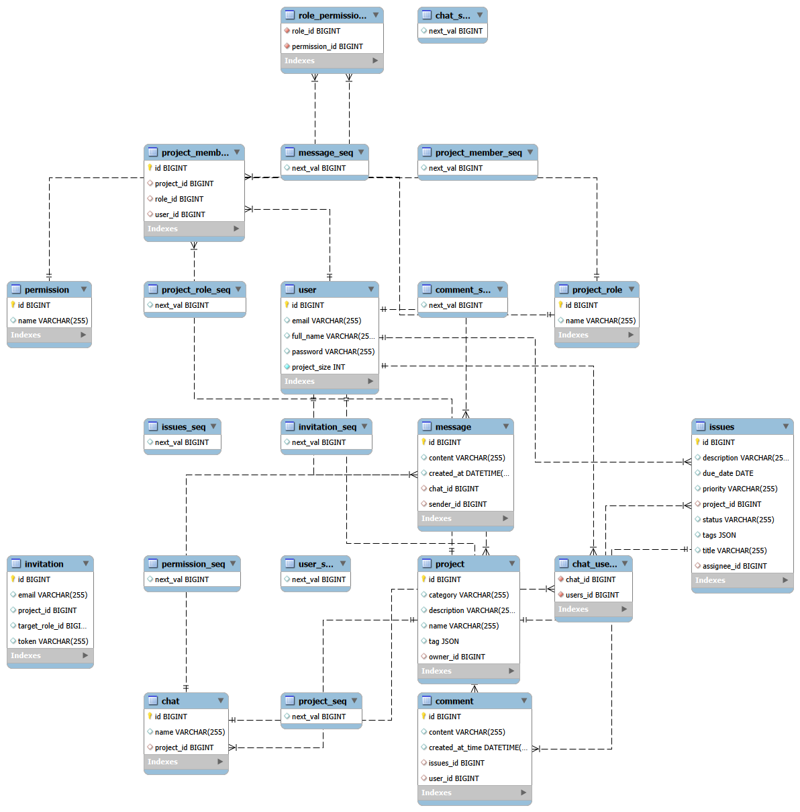
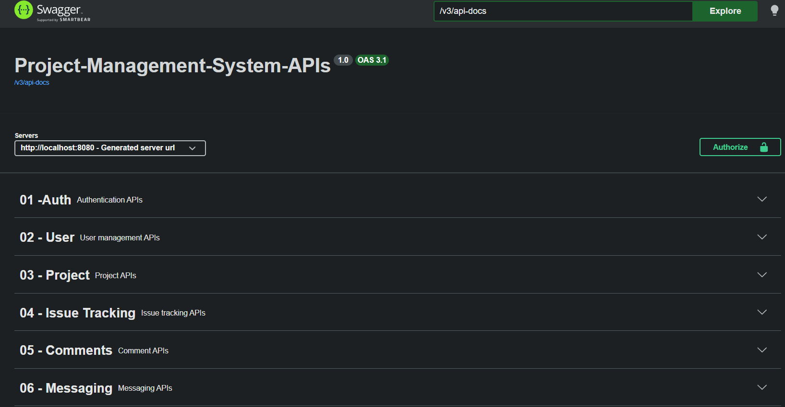
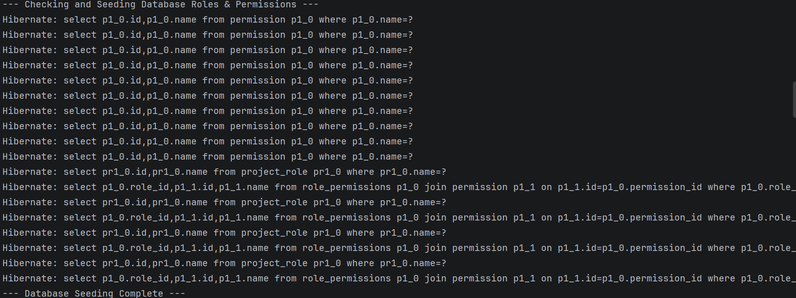

# Project-Management-System-Spring-Boot

[](https://www.oracle.com/java/)
[](https://spring.io/projects/spring-boot)
[](https://www.mysql.com/)
[](https://hibernate.org/)
[](https://jwt.io/)
[](http://localhost:8080/swagger-ui/index.html)

A production-grade backend system built to demonstrate **advanced JPA relationship modeling**, **JWT-based security architecture**, **Granular Role-Based Access Control (RBAC)**, and **clean layered system design** using Spring Boot.

This project simulates a real-world **Project Management SaaS backend**, implementing:

- 👥 Multi-user project collaboration
- 📝 Issue tracking & threaded commenting
- 🛡️ Advanced Team-based access control (Jira-style RBAC modeling)
- 📨 Real-time project invitations via secure SMTP
- 📚 Automated Swagger UI API Documentation
- 🌱 Automated Database Seeding for system initialization
- 💬 Project-level real-time chat
- 💳 Subscription-ready billing architecture [Working]
- ⚛️ Upcoming React frontend

---

## 📖 Table of Contents
- [Architecture & Design](#-architecture--design)
- [Entity Relationship Model](#-entity-relationship-model)
- [Relationship Strategy](#-relationship-strategy)
- [Security & RBAC Architecture](#-security--rbac-architecture)
- [Key Features](#-key-features)
- [API Documentation](#-api-documentation)
- [Tech Stack](#-tech-stack)
- [Project Structure](#-project-structure)
- [Getting Started](#-getting-started)
- [Engineering Highlights](#-engineering-highlights)
- [Contact](#-contact)

---

# 🏛 Architecture & Design

The system follows a strict layered clean architecture:

```text
Client → JWT Filter → Controller → Service → Repository → Database
````

### Design Principles Applied

  - **Separation of Concerns:** Strict isolation between web, business, and data layers.
  - **DTO Pattern:** Ensures API payload isolation and prevents infinite recursion during bi-directional JSON mapping.
  - **Strict Cascade Control & Orphan Removal:** Maintains database integrity by automatically cleaning up child entities (like comments and issues) when a parent project is deleted.
  - **Intelligent Initialization:** Bootstraps critical application data (Roles and Permissions) automatically on startup.
  - **Token-Based Stateless Authentication:** No server-side sessions; fully scalable.

-----
1. For the "Entity Relationship Model" Section
   
Below is the production database schema showing the relationships between Users, Projects, Issues, and the RBAC system.



2. For the "API Documentation" Section

The backend is fully documented using **OpenAPI 3.1** and **Swagger UI**. This interactive interface allows for real-time endpoint testing and schema validation.



Once the application is running, navigate to:  
👉 `http://localhost:8080/swagger-ui/index.html`

3. For the "Key Features" Section
### 🛡️ Authentication & User Profile
| Login & Security | User Profile |
| :---: | :---: |
|  |  |

### 📁 Project Management
| Creating a Project | Search Functionality |
| :---: | :---: |
|  |  |

### 📝 Issue Tracking & Assignments
| Adding an Assignee | Issue Overview |
| :---: | :---: |
|  |  |

### 💬 Real-Time Collaboration
The integrated chat system allows for seamless communication within project teams.

# 🔐 Security & RBAC Architecture

Authentication is fully stateless and implemented using **Spring Security** and **JWT**.

### 🛡️ Hierarchical Role-Based Access Control

Unlike simple roles, this system validates specific **Permissions** at the method level using `@PreAuthorize`.

| Role | Permissions Assigned | Use Case |
| :--- | :--- | :--- |
| **PROJECT\_OWNER** | *All 10 Permissions* | Project creator. Full administrative and destructive power. |
| **ADMIN** | *9 Permissions* (No `DELETE_PROJECT`) | Trusted manager for team and task coordination. |
| **DEVELOPER** | `READ`, `CREATE_ISSUE`, `UPDATE_ISSUE`, `COMMENT` | Core team member focused on task execution. |
| **VIEWER** | `READ_PROJECT` only | Read-only access for stakeholders or clients. |

**Code Implementation Example:**

```java
@PreAuthorize("@projectSecurity.hasPermission(authentication, #projectId, 'INVITE_USERS')")
public ResponseEntity<MessageResponse> inviteProjectMember(...)
```

-----

# 🌟 Key Features

### 🔹 Advanced ORM Mapping

  - Mastered use of `@OneToOne`, `@OneToMany`, and `@ManyToMany`.
  - Controlled cascading strategies and proxy lazy loading optimization.

### 🔹 Automated System Seeding

  - `DatabaseSeeder` automatically populates essential database tables (Roles & Permissions) on startup to ensure a production-ready state.

### 🔹 Secure Email Integration

  - Real-time project invitations sent via **Jakarta Mail (SMTP)** using secure STARTTLS encryption.

### 🔹 Issue Tracking Engine

  - Status handling, priority modeling, due date management, and DTO abstraction.

### 🔹 SaaS-Ready Subscription Modeling

  - `PlanType` enum (FREE / MONTHLY / ANNUAL) with an extensible billing architecture.

-----

# 📋 API Documentation

The backend exposes a fully interactive **Swagger UI** for real-time endpoint testing and schema validation.

Once the application is running, navigate to:
👉 **[http://localhost:8080/swagger-ui/index.html](https://www.google.com/search?q=http://localhost:8080/swagger-ui/index.html)**

### Core Endpoint Modules:

1.  **Auth APIs:** Registration & JWT Login.
2.  **User APIs:** Profile management.
3.  **Project APIs:** Collaboration, RBAC Invitations, and Team management.
4.  **Issue APIs:** Task lifecycle (Create → Assign → Status Update).

-----

# 🛠 Tech Stack

| Layer | Technology |
| :--- | :--- |
| **Language** | Java 17 |
| **Framework** | Spring Boot 3.x |
| **Security** | Spring Security 6 + JWT (jjwt) |
| **ORM** | Hibernate / Spring Data JPA |
| **Database** | MySQL 8.0 |
| **API Docs** | SpringDoc OpenAPI 3 (Swagger) |
| **Mailing** | Jakarta Mail (SMTP) |

-----

# 📂 Project Structure

```text
src/main/java/com/example/ProjectManagementSystem
├── config          # JWT, Security, CORS, and Swagger configs
├── controller      # REST API endpoints with @PreAuthorize gates
├── service         # Business logic and cross-entity validations
├── repository      # Spring Data JPA interfaces
├── model           # JPA entities & DTOs
├── request         # Request Payload definitions
├── response        # Standardized Response schemas
└── seeder          # DatabaseSeeder for automated DB initialization
```

-----

# 🚀 Getting Started

## Prerequisites

  - JDK 17+
  - Maven 3.8+
  - MySQL 8.0+ running locally
  - Gmail App Password (for SMTP invitations)

-----

## 1️⃣ Clone Repository

```bash
git clone [https://github.com/Sarfaraz-E/project-management-system-backend.git](https://github.com/Sarfaraz-E/project-management-system-backend.git)
cd project-management-system-backend
```

-----

## 2️⃣ Configure Environment

Update `src/main/resources/application.properties`:

```properties
# Database Configuration
spring.datasource.url=jdbc:mysql://localhost:3306/projectmanagement
spring.datasource.username=root
spring.datasource.password=your_database_password
spring.jpa.hibernate.ddl-auto=update
spring.jpa.show-sql=true

# SMTP Mail Configuration (For Invitations)
spring.mail.host=smtp.gmail.com
spring.mail.port=587
spring.mail.username=your_email@gmail.com
spring.mail.password=your_16_digit_app_password
spring.mail.properties.mail.smtp.auth=true
spring.mail.properties.mail.smtp.starttls.enable=true
```

-----

## 3️⃣ Run Application

Using Maven wrapper:

```bash
./mvnw spring-boot:run
```

The application will start, seed the database, and be available at:
`http://localhost:8080`
4. For the "Getting Started" Section
The application will automatically seed the database on startup. Look for the following in your console to verify system initialization:


-----

# 🧠 Engineering Highlights

This project goes beyond basic CRUD operations to demonstrate:

  - Real-world **JPA ownership modeling** and database relational integrity.
  - **Method-level security authorization** to protect critical data flows.
  - **Stateless architecture** ensuring high scalability.
  - **Defensive programming** against infinite JSON loops and data exposure.
  - Clean code separation across well-defined layers.


 Designed & Developed by Sarfaraz Essa


## 📬 Contact

**Sarfaraz Essa**
📧 [sarfarazessa18@gmail.com](mailto:sarfarazessa18@gmail.com)
🔗 [LinkedIn](https://www.linkedin.com/in/sarfaraz-essa/)
